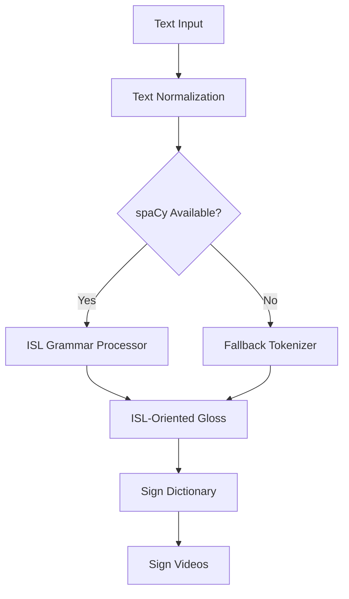

# ISL NLP Architecture

This document describes the Natural Language Processing (NLP) pipeline used in Direction B (Text/Voice \u2192 ISL) of the Bidirectional Indian Sign Language Interpreter.

## Overview

ISL is a distinct language with its own grammar, not simply English with a reversed word order. Standard English typically follows a Subject-Verb-Object (SVO) structure, while ISL typically follows a Subject-Object-Verb (SOV) structure.

Our NLP pipeline bridges this gap by automatically restructuring English input into an ISL-oriented gloss before looking up the signs.

## Architecture Pipeline



### 1. Normalization
Strips complex punctuation, converts text to lowercase, and trims extraneous whitespace.

### 2. ISL Grammar Processor (`isl_nlp_service.py`)
This service uses the `spaCy` NLP library (specifically `en_core_web_sm`) to parse English grammar dependencies.

**Process:**
- Stop words (e.g., "am", "is", "the") are filtered out.
- The dependency of each remaining token (e.g., `nsubj`, `dobj`, `ROOT`) is analyzed.
- Tokens are reordered into an ISL-oriented grammar bucket based on their linguistic roles:
  `Subject -> Adjectives -> Objects -> Verbs -> Negation -> WH-Questions`.
- Unmapped dependencies (e.g., secondary clauses) are collected and appended to the end of the sentence to preserve meaning without disrupting the primary SOV structure.

### 3. Gloss Generation
The processor generates a sequence of `GlossToken` objects. These contain the original word, the lemmatized word (gloss root), and their syntactic role.

### 4. Sign Dictionary Lookup
The system looks up the lemmatized gloss strings in the canonical `SignDictionary`.
- If a sign video exists, it is queued for playback.
- If a sign video does not exist, the word is returned as an `unsupported_word` so the frontend can handle it (e.g., via fingerspelling).

## NLP \u2192 Dictionary Integration

The handoff between the NLP Gloss Sequence and the `SignDictionary` involves several specific data normalization and deduplication steps:

- **Canonical Glosses & Case Normalization**: The dictionary resolves all words case-insensitively (e.g., "eat", "Eat", and "EAT" all correctly resolve to the `eat_food` canonical sign ID).
- **Aliases**: A single sign might have multiple accepted string aliases mapping to the same canonical sign ID (e.g., `indian` maps to "indian" and "india", `eat_food` maps to "eat" and "food"). 
- **Duplicate Handling**:
  - **Alias Collision**: If a sentence contains two different aliases that map to the *same* canonical ID in succession (e.g., "I eat food" \u2192 "eat" and "food"), the dictionary lookup layer deduplicates them to prevent playing the same video unnecessarily (`EAT, EAT` \u2192 `EAT`).
  - **Intentional Repeats**: If a sentence intentionally repeats a word (e.g., "no no"), the underlying tokens' lemmas are identical, and the duplicate signs are intentionally preserved for playback (`NO, NO`).
- **Unsupported Words & Partial Translation**: We explicitly *do not* invent fake signs. If an input contains unsupported vocabulary (e.g., "What is your name"), the backend returns the matched signs (if any) and cleanly surfaces the missing words in the `unsupported_words` array without failing the translation.

## Dependencies

- **Package**: `spacy>=3.7.0`
- **Model**: `en_core_web_sm`
- **Installation**:
  ```bash
  pip install spacy
  python -m spacy download en_core_web_sm
  ```

## Fallback Behavior

If `spaCy` or its language model cannot be loaded, the system safely falls back to simple SVO tokenization. This ensures the web application starts and functions (as a basic word-to-sign dictionary mapper) even in limited environments.

## Known Limitations

- **Linguistic Completeness**: This is an MVP layer adapted from a previous Hackathon project. It handles basic SVO \u2192 SOV transformations but does not fully support complex compound sentences, rhetorical questions, or intense spatial/directional verbs.
- **Tense**: Tense markers (like "yesterday", "tomorrow") are not yet automatically moved to the beginning of the sentence as is standard in deep ISL grammar.
- **Unmapped Clauses**: Complex nested clauses may lose exact ISL syntactic positioning and currently fall to the end of the sentence structure.
